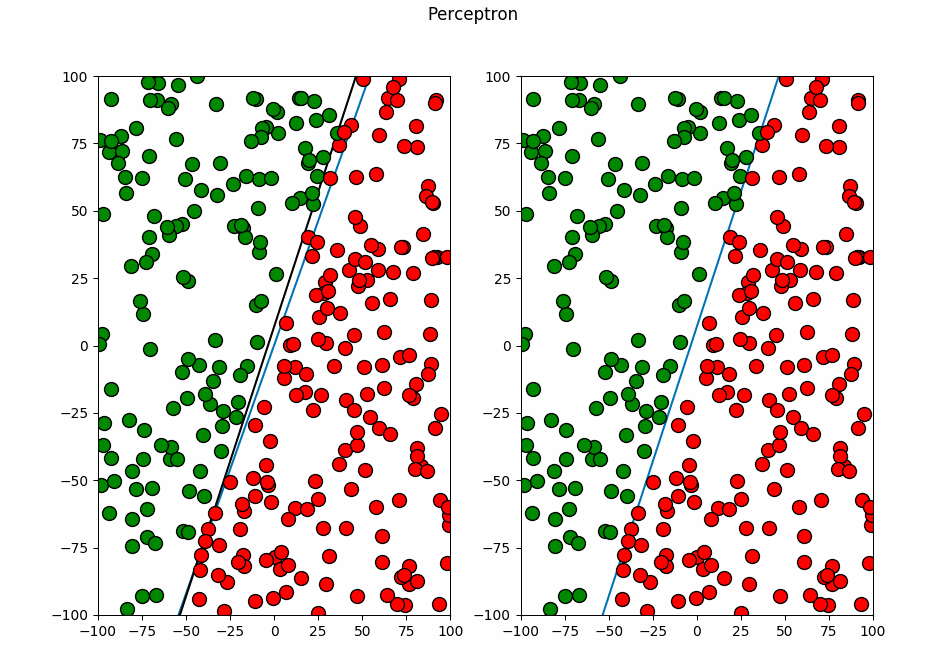

# Perceptron

# Introduction
A quick and easy implementation of a simple single layer perceptron. I built it from the scratch in Python, numpy is not even used in the implementation. Feel free to use this as a simple single layer perceptron library. Python's 2D Graphing Library 'Matplotlib' is used for plotting and animation.

# Installation
1. To install matplotlib type in the terminal: 'pip install matplotlib'
2. Run the main.py file.

# Output

# Learning Resources
I got the basic idea of a perceptron from Daniel Shiffman's Tutorial. It found it very helpful for the beginners to start Perceptron and Neural Network Stuffs. 
Here is the link of the video: https://www.youtube.com/watch?v=ntKn5TPHHAk&t=1505s
